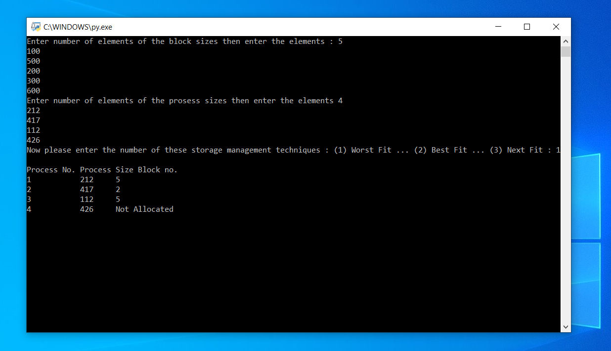
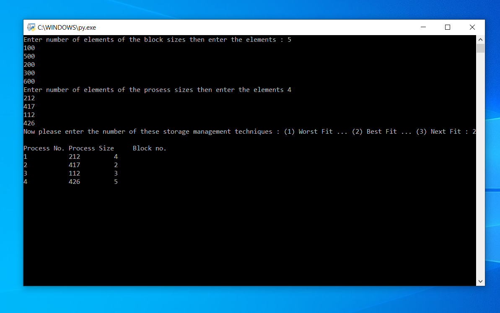
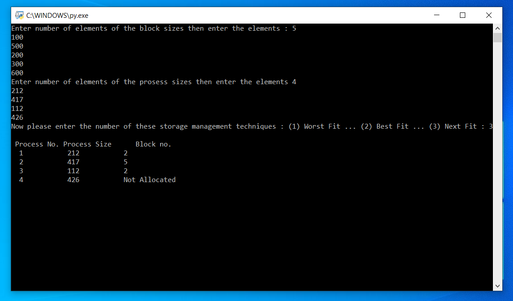

### Storage Management

Memory management is an operating system feature that handles or controls primary memory and transfers processes during execution back and forth between main memory and disk. Memory management keeps track of each and every location of the memory, regardless of whether it is reserved or free to a process. It checks the amount of memory that must be allocated to processes. It specifies at what time which process will receive memory. It monitors any time some memory is released or unallocated and updates the status accordingly.

The recent [Demonstration](https://youtu.be/lf5ocDQCy70) of the **Storage Management** techniques.

> [!Note]
> Using the [recommended inputs](recommended_input.txt).

## In this program we will review 3 techniques of memory storage management with a sample algorithm written in python:

Starting the program asking for the block size data to store in a list. Then we have to choose one of the three techniques to move on.

# 1.Worst_Fit

Worst Fit assigns to the partition a method that is sufficient for the largest of the freely accessible partitions in the main memory. If a large process arrives at a later stage, there would be no space for memory to handle it.

```python
allocation = [-1] * n
    for i in range(n):
        wstIdx = -1
        for j in range(m):
            if blockSize[j] >= processSize[i]:
                if wstIdx == -1:
                    wstIdx = j
                elif blockSize[wstIdx] < blockSize[j]:
                    wstIdx = j
        if wstIdx != -1:
            allocation[i] = wstIdx
            blockSize[wstIdx] -= processSize[i]

    print("Process No. Process Size Block no.")
    for i in range(n):
        print(i + 1, "         ",
              processSize[i], end = "     ")
        if allocation[i] != -1:
            print(allocation[i] + 1)
        else:
            print("Not Allocated")
```

Find max(bockSize[1],blockSize[2],.....blockSize[n]) >processSize[current] by selecting each process and finding the maximum block size that can be allocated to the current process. If found, allocate it to the current process. If not, quit the process and continue to review the additional processes.


# 2.Best_Fit

The best fit allocates the process to a partition among the free partitions available, which is the smallest enough partition.

```python
def bestFit(blockSize, m, processSize, n):
    allocation = [-1] * n
    for i in range(n):
        bestIdx = -1
        for j in range(m):
            if blockSize[j] >= processSize[i]:
                if bestIdx == -1:
                    bestIdx = j
                elif blockSize[bestIdx] > blockSize[j]:
                    bestIdx = j
        if bestIdx != -1:
            allocation[i] = bestIdx
            blockSize[bestIdx] -= processSize[i]

    print("Process No. Process Size     Block no.")
    for i in range(n):
        print(i + 1, "         ", processSize[i],
                                end = "         ")
        if allocation[i] != -1:
            print(allocation[i] + 1)
        else:
            print("Not Allocated")
```



Start by choosing each process and finding the minimum block size that can be allocated to
the current process, find min(bockSize[1], blockSize[2],.....blockSize[n]) >
processSize[current], and assign it to the current process if it is found. If not, quit the
process and continue to review the additional processes.

# 3.Next_Fit

The next fit is the updated 'first fit' version. It starts as the first fit to discover a free partition, but it begins to search from where it left off when named next time, not from the beginning. A roving pointer makes use of this strategy. To look for the next suit, the pointer travels along the memory chain. This helps prevent the use of memory from the head (beginning) of the free block chain at all times.

```python
def firstFit(blockSize, m, processSize, n):
    allocation = [-1] * n
    for i in range(n):
        for j in range(m):
            if blockSize[j] >= processSize[i]:
                allocation[i] = j
                blockSize[j] -= processSize[i]
                break

    print(" Process No. Process Size      Block no.")
    for i in range(n):
        print(" ", i + 1, "         ", processSize[i],
                          "         ", end = " ")
        if allocation[i] != -1:
            print(allocation[i] + 1)
        else:
            print("Not Allocated")
```

Start by selecting each process and checking if it can be allocated to the current block, assigning the appropriate memory if yes, and checking for the next process, but not from the block where we left off. If the current size of the block is smaller, continue to search the other blocks.


